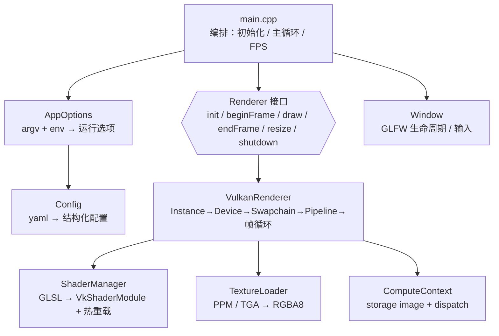
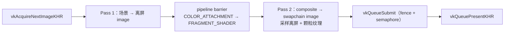

# Tiny-rasterizer

用**原生 Vulkan C API** 写的迷你渲染器学习项目：窗口里绘制一张全屏四边形，画面完全由片段着色器程序化生成，再经过离屏后处理链合成输出。

- 后端：Vulkan 1.1（macOS 走 MoltenVK，Windows 走官方 Loader），仓库内不含任何 OpenGL 代码
- 不引入 Volk / VMA / 第三方图像库；窗口用 GLFW，配置用 yaml-cpp
- 目标是把「Vulkan 从初始化到出画面」的全链路走通，并把每一步的验收做成可自动化的检查

## 特性

| 特性             | 说明                                                                                            |
| ---------------- | ----------------------------------------------------------------------------------------------- |
| 三个可切换场景   | 旋转矩阵 / 分形 raymarch / 水面，运行时按数字键切换（重建图形管线）                             |
| 后处理链         | 场景渲染到离屏 target → pipeline barrier → 全屏合成（曝光 / 暗角 / 颗粒），`P` 键实时开关       |
| 颗粒纹理三种来源 | 文件（PPM/TGA，自研解码器）/ GPU compute 生成 / CPU 程序化生成，由配置显式指定                  |
| 着色器双模式     | 构建期 `glslc` 产出 SPIR-V，或运行时编译 GLSL（`runtime_compile`），支持源文件热重载            |
| 帧同步           | 2 帧 in-flight，fence + acquire/present semaphore                                               |
| resize 稳定      | 交换链重建（含离屏目标与描述符集重写），自动处理 `OUT_OF_DATE` / `SUBOPTIMAL`                   |
| 可观测性         | 分层日志（init/vulkan/shader/texture/compute/post/frame）+ 退出时验收基线 + validation 错误计数 |
| Compute 扩展位   | `ComputeContext` 提供 pipeline / descriptor / dispatch / 显式同步点，首个任务为生成噪声纹理     |

## 技术栈

| 方面        | 选择                                                      |
| ----------- | --------------------------------------------------------- |
| 语言 / 标准 | C++17                                                     |
| 窗口系统    | GLFW（`GLFW_CLIENT_API = GLFW_NO_API`，不创建 GL 上下文） |
| 图形 API    | Vulkan 1.1，原生 C API                                    |
| 着色器      | GLSL 450 → SPIR-V（`glslc`，支持离线与运行时两种模式）    |
| 配置        | yaml-cpp（`config/shader_config.yaml`）                   |
| 构建        | CMake ≥ 3.10 + `CMakePresets.json`，构建期编译全部着色器  |
| 测试        | CTest（11 个用例，含无头初始化与严格验证层验收）          |

## 架构



分层约束：

1. 渲染器只依赖 `Config` 与每帧参数 `FrameParams`，不读环境变量、不含测试分支；
2. 所有 argv / 环境变量只在 `AppOptions` 中解析，再投影回配置层；
3. 业务层（`main.cpp`）不直接调用任何 Vulkan API。

### 目录结构

| 路径                | 内容                                                                                                                               |
| ------------------- | ---------------------------------------------------------------------------------------------------------------------------------- |
| `include/` `src/`   | 渲染器与各资源模块（`VulkanRenderer` / `ComputeContext` / `ShaderManager` / `TextureLoader` / `Window` / `Config` / `AppOptions`） |
| `shaders/`          | GLSL 源码：`vertex` / `rotation_matrix` / `fragment` / `water` / `composite` / `grain`(compute)                                    |
| `config/`           | `shader_config.yaml`                                                                                                               |
| `textures/`         | 示例纹理资源（构建后拷到可执行文件目录）                                                                                           |
| `tests/`            | CTest 用例（配置冒烟、纹理解码）                                                                                                   |
| `CMakePresets.json` | `macos-debug` / `windows-debug` 预设                                                                                               |

### 一帧的流程



资源与同步要点：

- 描述符集：scene set = 每帧 UBO；composite set = 离屏采样器 + 颗粒纹理 + `PostParams` UBO；
- 交换链重建后必须重写 composite 描述符集，否则 imageView 悬空；
- 纹理上传：staging buffer → `vkCmdCopyBufferToImage` → `UNDEFINED → TRANSFER_DST → SHADER_READ_ONLY`；
- compute：`UNDEFINED → GENERAL` → dispatch → `COMPUTE_SHADER → FRAGMENT_SHADER` barrier → `SHADER_READ_ONLY`。

## 构建

### 依赖

| 平台    | 依赖                                                                     |
| ------- | ------------------------------------------------------------------------ |
| macOS   | Vulkan SDK（提供 MoltenVK 与 `glslc`）、`glfw3`、`yaml-cpp`              |
| Windows | LunarG Vulkan SDK（Loader + `glslc`）、`glfw3`、`yaml-cpp`（推荐 vcpkg） |

### macOS

```bash
brew install glfw yaml-cpp
cmake --preset macos-debug
cmake --build --preset macos-debug -j
ctest --test-dir build/macos-debug --output-on-failure
```

### Windows

```powershell
# 需安装 LunarG Vulkan SDK，并设置 VCPKG_ROOT 指向 vcpkg
cmake --preset windows-debug
cmake --build --preset windows-debug
ctest --test-dir build/windows-debug --output-on-failure
```

不使用 preset 时：

```bash
cmake -S . -B build -DCMAKE_BUILD_TYPE=Debug
cmake --build build -j
```

构建期会把着色器编译成 `shaders_spirv/*.spv`，并连同 `shaders/`、`config/`、`textures/` 一起拷贝到可执行文件目录。

## 运行

```bash
./build/macos-debug/Tiny-rasterizer               # 使用默认配置
./build/macos-debug/Tiny-rasterizer my.yaml       # 指定配置文件
```

| 按键        | 作用                                                          |
| ----------- | ------------------------------------------------------------- |
| `1` `2` `3` | 切换场景（rotation_matrix / fractal / water），会重建图形管线 |
| `P`         | 后处理开关                                                    |

也可以直接用 `./quick_switch.sh <场景名>` 修改构建目录中的配置。

## 配置速览

完整字段说明见 [CONFIG_USAGE.md](CONFIG_USAGE.md)。

```yaml
window:          { width: 1000, height: 600, vsync: false }   # vsync → present mode 选择
shader:          { runtime_compile: false, hot_reload: false, spirv_dir: "shaders_spirv" }
post_processing: { enabled: true, exposure: 1.05, vignette: 0.35, grain: 0.05,
                   texture_source: "file", texture: "textures/grain.ppm" }
compute:         { enabled: true, grain_shader: "shaders/grain.glsl", texture_size: 256, seed: 1 }
```

## 测试与验收

```bash
ctest --test-dir build/macos-debug --output-on-failure
```

| 用例                                                                                    | 覆盖点                                                         |
| --------------------------------------------------------------------------------------- | -------------------------------------------------------------- |
| `config_active_scene` / `config_scene_catalog` / `config_window` / `config_performance` | 配置各段解析结果                                               |
| `config_shader_sources`                                                                 | 场景引用的 GLSL 文件存在且非空                                 |
| `shader_spirv_outputs`                                                                  | 构建期 SPIR-V 产物齐全（含 compute 的 `grain.spv`）            |
| `texture_decoder_roundtrip`                                                             | PPM(P3/P6) / TGA(type 2/3/10/11) 解码逐像素校验 + 损坏输入报错 |
| `texture_config_binding`                                                                | 配置里声明的纹理可被解码                                       |
| `vulkan_headless_core_init`                                                             | Instance → PhysicalDevice → Device 核心初始化                  |
| `vulkan_frame_stress_strict`                                                            | resize + 后处理切换 + 场景切换压测，零 validation error        |
| `vulkan_compute_noise_strict`                                                           | compute 生成纹理路径，零 validation error                      |

手动验收用的环境变量（统一由 `AppOptions` 解析）：

| 变量                                      | 作用                                    |
| ----------------------------------------- | --------------------------------------- |
| `TINY_RASTERIZER_MAX_FRAMES=N`            | 跑 N 帧后退出（N > 0 时窗口自动隐藏）   |
| `TINY_RASTERIZER_HEADLESS_TEST=1`         | 仅初始化核心对象，不创建窗口            |
| `TINY_RASTERIZER_STRESS_TEST=1`           | 自动 resize + 切换后处理 / 场景         |
| `TINY_RASTERIZER_STRICT_VALIDATION=1`     | 出现 validation error 时以退出码 2 结束 |
| `TINY_RASTERIZER_FORCE_COMPUTE_TEXTURE=1` | 把纹理来源覆盖为 compute                |

```bash
# 长跑：稳定 present 且零 validation error
TINY_RASTERIZER_MAX_FRAMES=18000 TINY_RASTERIZER_STRICT_VALIDATION=1 ./build/macos-debug/Tiny-rasterizer
```

退出时会打印验收基线：

```
=== 验收基线 ===
启动耗时 / 运行时长 / 总帧数 / 平均帧时 / 最差帧时 / resize 次数 / validation 计数
```

## 跨平台差异

| 项            | macOS                                                                                              | Windows        |
| ------------- | -------------------------------------------------------------------------------------------------- | -------------- |
| Vulkan 实现   | MoltenVK                                                                                           | 官方 Loader    |
| 必需扩展      | `VK_KHR_portability_enumeration`（实例，含 portability flag）+ `VK_KHR_portability_subset`（设备） | 无             |
| 实例 API 版本 | 探测后请求 1.1，以满足 portability_subset 的依赖                                                   | 同             |
| present mode  | 常见 `FIFO` / `IMMEDIATE`，`MAILBOX` 依版本                                                        | 通常三种都支持 |
| 验证状态      | 已实测：11/11 用例通过，压测与 compute 均零 validation error                                       | 待实机验证     |

## 实现状态

从 OpenGL 迁移到 Vulkan 共分 8 个阶段，现已全部落地（Windows 待实机验证）：

| 阶段      | 里程碑                                            | 状态                |
| --------- | ------------------------------------------------- | ------------------- |
| Phase 0-1 | 可观测性与验收基线；渲染后端接口解耦              | ✅                   |
| Phase 2-3 | 构建系统切换到 Vulkan；核心初始化、交换链与帧同步 | ✅                   |
| Phase 4-5 | 最小绘制管线；场景切换与着色器热重载              | ✅                   |
| Phase 6   | 纹理上传链路；离屏渲染 + 全屏合成                 | ✅                   |
| Phase 7   | `ComputeContext` + GPU 生成噪声纹理               | ✅                   |
| Phase 8   | 移除 OpenGL 代码与配置遗留；跨平台收敛            | ✅（Windows 待验证） |

各阶段的详细目标、技术决策与验收标准保留在 [VULKAN_NOTES.md](VULKAN_NOTES.md) 的附录「迁移路线图原文」。

### 已知限制

- 未实现 MSAA（固定 1 sample）；纹理无 mipmap / 各向异性过滤
- 顶点缓冲与 UBO 使用 host-visible 内存，未走 staging 上传
- 切换场景会重建图形管线，尚未预创建并缓存各场景管线
- Compute 仅在与图形队列同族时启用，跨队列同步是预留的扩展点

## 文档

| 文档                                       | 内容                                                  |
| ------------------------------------------ | ----------------------------------------------------- |
| [VULKAN_NOTES.md](VULKAN_NOTES.md)         | Vulkan API 速查、渲染基础常识、阶段实现对照、踩坑清单 |
| [CONFIG_USAGE.md](CONFIG_USAGE.md)         | 配置文件与入口选项完整说明                            |
| [GPU_OPTIMIZATION.md](GPU_OPTIMIZATION.md) | 性能设置、已知瓶颈与优化方向                          |
| [debug.md](debug.md)                       | 历史调试记录                                          |

## 项目性质

个人学习项目，未附带许可证；代码与文档以理解 Vulkan 渲染流程为目的，欢迎按需取用。
