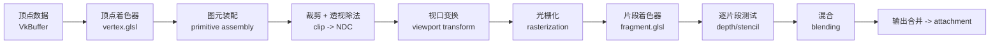
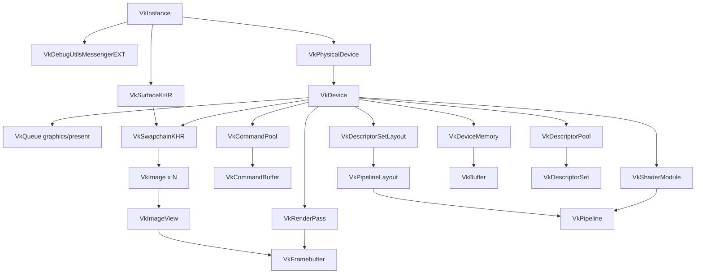
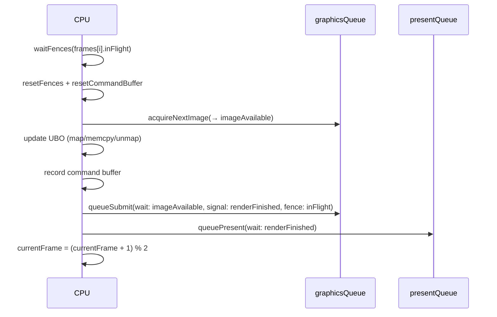

# Vulkan API 与渲染基础笔记（Tiny-rasterizer 版）

本文档有两个用途：

1. **进度对照**：按 `README.md` 的分阶段标准，核对本仓库当前实现到哪一步、还差什么。
2. **知识手册**：把本项目真实用到的 Vulkan API 与渲染基础常识整理成可检索的条目，每条都指向本仓库的对应实现。

> 判定依据：`src/VulkanRenderer.cpp`、`src/ShaderManager.cpp`、`CMakeLists.txt`、`config/shader_config.yaml` 的实际代码，以及 `cmake --build` + `ctest` 的实际运行结果。
> 最近一次核对：configure rc=0，build rc=0，`ctest` 7/7 通过，headless smoke 通过（Apple M2 / MoltenVK）。

---

## 第一部分：进度检查

### 总览

| 阶段 | 内容 | 状态 | 证据 |
| --- | --- | --- | --- |
| Phase 0 | 基线冻结与可观测性 | ✅ 完成 | 分层日志 + FPS/Min/Max；退出时输出验收基线（启动耗时/平均帧时/最差帧时/resize 次数/validation 计数） |
| Phase 1 | 架构解耦 | ✅ 完成 | `include/Renderer.h` 抽象接口；`main.cpp` 只调接口；`Window` 已无 GL 上下文职责 |
| Phase 2 | 构建系统切换 Vulkan | ✅ 完成 | `find_package(Vulkan REQUIRED)`；无 OpenGL/GLEW 链接；`glslc` 离线编译 + 运行时编译（含 compute 阶段） |
| Phase 3 | Vulkan 核心初始化 | ✅ 完成 | Instance/Validation/DebugMessenger/Device/Surface/Swapchain/双帧同步 + resize 重建；验证层错误计数 + 严格退出码 |
| Phase 4 | 最小可绘制管线 | ✅ 完成 | RenderPass + Framebuffer + GraphicsPipeline + VertexBuffer + UBO + DescriptorSet |
| Phase 5 | 场景与材质兼容 | ✅ 完成 | `ShaderConfig` 双路径、`ShaderManager` 缓存 `VkShaderModule` + 热重载、三场景数字键切换 |
| Phase 6 | 纹理与后处理 | ✅ 完成 | `TextureLoader` 解码 PPM(P3/P6)/TGA(2/3/10/11) → staging → image → layout transition；离屏 + composite pass；resize/后处理切换压测用例 |
| Phase 7 | Compute 扩展预留 | ✅ 完成 | `ComputeContext`（storage image descriptor + compute pipeline + dispatch + 写→读同步点）；首个任务：GPU 生成噪声纹理 |
| Phase 8 | 跨平台收敛 + 移除 OpenGL | ✅ macOS 完成 | OpenGL 文件/配置/文档全部移除；`window.vsync` 接入 present mode；Windows 待实机验证 |

### 逐阶段明细

**Phase 1 — 架构解耦** ✅

- `Renderer` 纯虚接口：`init` / `beginFrame` / `draw` / `endFrame` / `resize` / `shutdown`，当前唯一实现为 `VulkanRenderer`。
- `Window` 只剩 GLFW 生命周期、输入、尺寸查询（含 `setWindowSize` 供压测）；GL 上下文通过 `VulkanRenderer::configureWindowHints()` 用 `GLFW_CLIENT_API=GLFW_NO_API` 关闭。
- 每帧参数统一为 `FrameParams{time,width,height,mouseX,mouseY}`（`include/RenderTypes.h`），`main.cpp` 不出现任何图形 API 调用。

**Phase 2 — 构建系统** ✅

- 依赖：`Vulkan` / `glfw3` / `yaml-cpp`；`GLFW_INCLUDE_NONE` 已定义，防止混入 GL 头。
- macOS 通过 MoltenVK：实例层按需启用 `VK_KHR_portability_enumeration` 并带 `VK_INSTANCE_CREATE_ENUMERATE_PORTABILITY_BIT_KHR`；设备层按需启用 `VK_KHR_portability_subset`。
- Shader 双模式：`add_spirv_shader()` 在构建期用 `glslc -fshader-stage=...` 产出 `shaders_spirv/*.spv`，构建后连同 `shaders/`、`config/` 一起拷到输出目录。

**Phase 3 — 核心初始化** ✅（超出最低要求）

- Instance → DebugMessenger → Surface → PhysicalDevice → LogicalDevice → Swapchain 链路完整。
- 验证层开关：`kEnableValidationLayers = true`（仅 `DEBUG` 宏下），且在运行时先查 `vkEnumerateInstanceLayerProperties`，缺失时降级并打印告警。Debug Messenger 的函数指针用 `vkGetInstanceProcAddr` 动态获取（探针扩展的常规做法）。
- 队列族：分别挑 `graphicsFamily` 与 `presentFamily`（允许同族去重）。
- Swapchain：`B8G8R8A8_SRGB` + `SRGB_NONLINEAR_KHR` 优先；present mode 由 `window.vsync` 决定（关→`MAILBOX`/`IMMEDIATE`，开→`FIFO`/`FIFO_RELAXED`）；`currentExtent == UINT32_MAX` 时用 `glfwGetFramebufferSize` + clamp。
- 同步：`kMaxFramesInFlight = 2`，每帧一个 fence + `imageAvailable`/`renderFinished` 两个 semaphore。
- resize：`resize()` 在尺寸变化时置 `framebufferResized`（尺寸相同则忽略，避免首帧多余重建）；`beginFrame` 早退并在 extent 非 0 时 `recreateSwapchain()`；`acquire` 返回 `VK_ERROR_OUT_OF_DATE_KHR`、`present` 返回 `OUT_OF_DATE`/`SUBOPTIMAL` 也触发重建。
- 验收 3「稳定 present 无 validation error」：已自动化为 `vulkan_frame_stress_strict` / `vulkan_compute_noise_strict` 两个用例（`TINY_RASTERIZER_STRICT_VALIDATION=1` 时有 error 返回 2）。
- 实例 API 版本：用 `vkEnumerateInstanceVersion` 探测后请求 1.1，以满足 `VK_KHR_portability_subset` 对 `VK_KHR_get_physical_device_properties2` 的依赖（见 VUID-01387）。

**Phase 4 — 最小绘制管线** ✅

- `VkRenderPass` + 每张 swapchain image 一个 `VkFramebuffer`；`createFullscreenPipeline()` 统一构造图形管线。
- 顶点数据用 `VkBuffer` 承载（全屏四边形 6 顶点，`kFullscreenQuad`），替代 VAO/VBO；视口/裁剪用动态状态（`vkCmdSetViewport`/`vkCmdSetScissor`）以避免重建管线。
- UBO 取代 `glUniform`：`FrameUniforms`（`iTime` / `iResolution` / `iMouse`）+ 每帧一份 `VkDescriptorSet`。

**Phase 5 — 场景兼容** ✅

- `config/shader_config.yaml` 的 `shader` 段落承载双路径：`runtime_compile` / `hot_reload` / `spirv_dir`。
- `ShaderManager`：GLSL 路径 → `VkShaderModule` 的缓存表，运行时模式调用 `glslc` 生成 `<stem>.dev.spv`（编译失败自动回退离线 SPIR-V）；用文件 mtime 判定热重载。
- 场景切换：`main.cpp` 数字键 → `renderer.setScene()` → `vkDeviceWaitIdle` + 销毁旧管线 + `rebuildScenePipeline()`。

**Phase 6 — 纹理与后处理** ✅

- 纹理链路：`TextureLoader` 解码 PPM(P3/P6) 与 TGA(type 2/3/10/11，含 RLE) → staging buffer → `vkCmdCopyBufferToImage` → `UNDEFINED → TRANSFER_DST → SHADER_READ_ONLY` layout transition（`createPostTexture()`）。
- 纹理来源由 `post_processing.texture_source` 显式指定（`file` / `compute` / `procedural`），渲染器内没有隐式优先级，也不读环境变量。
- 后处理：离屏 RenderPass + 每帧一个 offscreen target；composite 全屏合成 pass；`vkCmdPipelineBarrier` 连接两个 pass；配置层 `post_processing` 开关与 exposure/vignette/grain，P 键运行时切换。
- 验收：`texture_decoder_roundtrip`（造图→解码→逐像素校验，含损坏输入）、`texture_config_binding`（配置声明的纹理可加载）、`vulkan_frame_stress_strict`（resize + 后处理切换 + 场景切换，零 validation error）。
- 仍未做：mipmap / 各向异性过滤、MSAA（`rasterizationSamples` 固定 1）。

**Phase 7 — Compute** ✅

- `ComputeContext`：storage image descriptor set + compute pipeline + `vkCmdDispatch` 的最小闭环；设备/队列/命令池由渲染器注入，不接管其生命周期。
- 同步点显式化：`ComputeContext::insertWriteToReadBarrier()` 做 `COMPUTE_SHADER → FRAGMENT_SHADER`、`SHADER_WRITE → SHADER_READ` 且把 image 切到 `SHADER_READ_ONLY_OPTIMAL`；dispatch 前用 `transitionImageLayout(UNDEFINED → GENERAL)`。
- 首个 compute 任务：`shaders/grain.glsl` 用 `imageStore` 写入 256×256 噪声纹理，替代 CPU 端逐像素生成。
- 边界策略：只在与图形队列同族（同一队列）时启用；跨队列需要额外 semaphore，属于预留扩展点，此时回退 CPU 路径。
- 验收：`vulkan_compute_noise_strict`（`TINY_RASTERIZER_FORCE_COMPUTE_TEXTURE=1`，零 validation error）。

**Phase 8 — 移除 OpenGL** ✅（macOS）

- 已删除：`OpenGLRenderer.*`、`Shader.*`、`ShaderSource.*`。
- 已删除配置遗留：`GPUConfig`（`opengl_major`/`opengl_minor`/`samples`）与 yaml 的 `gpu:` 段。
- `GPU_OPTIMIZATION.md`、`CONFIG_USAGE.md` 已重写为 Vulkan 版本。
- `window.vsync` 已接入 present mode 选择，不再是空转配置。
- 剩余：Windows 实机验证（loader/驱动差异、present mode 支持范围）。

---

## 第二部分：渲染基础常识

### 1. 光栅化管线各阶段

顺序（图形管线固定顺序，只有部分阶段可编程）：



- 本项目是**全屏三角形对**场景：没有相机/矩阵，顶点着色器只把 `inPos` 直接输出（`shaders/vertex.glsl` 仅 5 行），所有画面由片段着色器按 `iResolution` 逐像素算出。
- 由于不需要深度测试，pipeline 的 `depthStencilState` 基本为空；这也意味着 Phase 6 之后若引入 3D 物体，需要补上 depth attachment 与其在 RenderPass 中的 `VkAttachmentDescription`。

### 2. 坐标与尺寸

- 顶点着色器输出裁剪空间（clip space）；`w` 除法后得到 NDC（$x,y \in [-1,1]$）。
- NDC 的 $y$ 向上为正；而 Vulkan 的 framebuffer 原点在左上、$y$ 向下——两者由视口变换（`VkViewport` 正/负 height）弥合。本项目视口 height 为正，因此全屏四边形顺序不影响结果。
- Vulkan framebuffer 的 NDC 深度范围是 $[0,1]$（OpenGL 为 $[-1,1]$）——这是从 GL 迁移时最容易踩的差异。
- `VkExtent2D` 单位为像素（framebuffer 尺寸），与逻辑窗口尺寸不同（Retina 下差 2 倍）。

### 3. 交换链与呈现

- 交换链 = 一组可呈现的 image（本项目随 swapchain 创建，逐个建 `VkImageView` + `VkFramebuffer`）。
- Present mode 语义：`FIFO`（垂直同步，必定支持）、`MAILBOX`（三缓冲不撕裂、低延迟）、`IMMEDIATE`（可能撕裂）。
- `vkAcquireNextImageKHR` 返回的是 image 索引，不是帧索引；索引与 in-flight 帧的配对关系是本项目最需要注意的同步点。
- 重建交换链必须 `vkDeviceWaitIdle` 且回收：framebuffer → renderPass → imageView → swapchain（本项目 `cleanupSwapchain()` 的顺序即此），离屏资源同理。

### 4. 颜色空间

- 表面格式选 `*_SRGB` 时，写入 attachment 的值会被自动编码为 sRGB，采样时自动解码为线性——后处理链中若混合使用 sRGB 与非 sRGB attachment，会出现整体偏亮/偏灰。
- 本项目离屏 target 与 swapchain 均为 8-bit UNORM/SRGB 级别，故后处理里的 `exposure` 是简单的线性乘法（`shaders/composite.glsl`）。

### 5. HDR / 后处理的常见结构

典型后处理链：`场景 → 离屏 RT → (全屏 pass: bloom/tonemap/exposure/vignette) → swapchain`。
本项目的实现即为该结构的最简形式，只是把「场景 pass」的产物直接当纹理喂给 composite，而没有中间降采样链。

---

## 第三部分：Vulkan 心智模型

### 6. 三条核心原则

1. **显式同步**：驱动不会替你在 CPU/GPU、队列之间等待，一切靠 fence / semaphore / pipeline barrier 表达。
2. **显式内存**：`VkBuffer`/`VkImage` 只是句柄，必须 `vkGet*MemoryRequirements` → `vkAllocateMemory` → `vkBind*Memory`。
3. **显式生命周期**：除了少数例外，几乎所有 `vkCreate*` 都有对应的 `vkDestroy*`，且必须在 GPU 不再使用后才能销毁（本仓库统一用 `vkDeviceWaitIdle` 兜底）。

### 7. 对象依赖树



要点：`VkSurfaceKHR` 由实例创建但依赖窗口系统；`VkSwapchainKHR` 依赖设备与表面，所以它的所有下游（imageView/framebuffer/renderPass 相关管线）都随 resize 重建。

### 8. 命令缓冲 vs 即时调用

- OpenGL 是"设置状态立刻生效"，Vulkan 是"录制到 `VkCommandBuffer`，提交到 `VkQueue` 后 GPU 才执行"。
- 因此 Vulkan 里的 `vkCmd*` 全部是**录制**，`vkQueueSubmit` 才是执行；`vkCmd*` 在 `vkBeginCommandBuffer`/`vkEndCommandBuffer` 之外调用是校验错误。
- 本项目两级用法：每帧复用的主命令缓冲（`frames[i].commandBuffer`），以及一次性的 `submitOneTimeCommands()`（临时分配 → 录制 → 提交 → `vkWaitForFences` → 释放）。

### 9. 队列族与并发

- 能力由队列族 flag 决定：`GRAPHICS_BIT`、`COMPUTE_BIT`、`TRANSFER_BIT`、`SPARSE_BINDING_BIT`。
- 支持呈现需要用 `vkGetPhysicalDeviceSurfaceSupportKHR` 单独查询——呈现不是队列 flag 而是 surface 属性。
- 若图形与呈现队列不同族，swapchain 需 `VK_SHARING_MODE_CONCURRENT` + `queueFamilyIndexCount`；本项目两族可取同族，用 `EXCLUSIVE` 即可。

### 10. 内存类型

- `vkGetPhysicalDeviceMemoryProperties` 给出 `memoryTypes[i].propertyFlags`：`DEVICE_LOCAL`（显存）、`HOST_VISIBLE`（可 map）、`HOST_COHERENT`（无需手动 flush）。
- 选择套路：`requiredProperties = typeFilter & (1 << i)` 且 `(propertyFlags & want) == want`（本项目 `findMemoryType()`）。
- 本项目三种用法：
  - 顶点/UBO：`HOST_VISIBLE | HOST_COHERENT`，直接 map 写入（简单，非最优）；
  - staging buffer：同上，用于 CPU → GPU 中转；
  - 离屏 image / grain image：`DEVICE_LOCAL`，只能经 staging 或 buffer-to-image 拷贝写入。

### 11. Image layout 与 pipeline barrier

- image 的 `layout`（`UNDEFINED` / `TRANSFER_DST_OPTIMAL` / `SHADER_READ_ONLY_OPTIMAL` / `COLOR_ATTACHMENT_OPTIMAL` / `PRESENT_SRC_KHR`）标明当前用途，驱动据此决定内存排布与缓存策略。
- 切换必须用 barrier，且 `srcStageMask`/`dstStageMask` 要覆盖"前后真正读写它的阶段"，否则会撞上同步校验错误或数据竞争：
  - 纹理上传：`TRANSFER` 写 → `FRAGMENT_SHADER` 读；
  - 离屏 → 合成：`COLOR_ATTACHMENT_OUTPUT` 写 → `FRAGMENT_SHADER` 读（本项目 `vkCmdPipelineBarrier` 就在两 pass 之间）。
- `vkCmdPipelineBarrier` 也是 RenderPass 之外唯一的"跨阶段可见性"手段。

### 12. 同步原语分工

| 原语 | 作用域 | 谁等谁 | 本项目用法 |
| --- | --- | --- | --- |
| `VkFence` | CPU 等 GPU | CPU | 等帧完成 / 等一次性提交完成 |
| `VkSemaphore` | GPU 等 GPU | 队列间 | acquire → submit、submit → present |
| `vkCmdPipelineBarrier` | GPU 管线阶段间 | 阶段 | layout 切换与读写可见性 |
| `vkDeviceWaitIdle` | 全局 | CPU | resize / 换场景 / 销毁前的粗粒度兜底 |

- Fence 必须 `vkResetFences` 才能复用；semaphore 不需要 reset（但同一 semaphore 不能在未完成时重复 wait）。
- 本项目 `kMaxFramesInFlight = 2`：CPU 最多领先 GPU 一帧，`vkWaitForFences(frames[currentFrame].inFlight)` 形成背压。

---

## 第四部分：API 速查表

### 13. 初始化与调试

| API | 作用 | 关键结构/参数 | 本项目位置 |
| --- | --- | --- | --- |
| `vkEnumerateInstanceExtensionProperties` | 列实例扩展 | — | `hasInstanceExtension()` |
| `vkEnumerateInstanceLayerProperties` | 列图层（验证层探测） | `VkLayerProperties` | `validationLayersAvailable()` |
| `vkCreateInstance` | 创建实例 | `VkInstanceCreateInfo`：`pApplicationInfo`、扩展、图层、`pNext`（调试信使）、`flags`（portability） | `createInstance()` |
| `vkGetInstanceProcAddr` | 取扩展函数指针 | `PFN_vkCreateDebugUtilsMessengerEXT` | `createDebugUtilsMessengerEXT()` |
| `vkCreateDebugUtilsMessengerEXT` | 安装校验回调 | severity/type 过滤 + `pfnUserCallback` | `setupDebugMessenger()` |
| `vkDestroyInstance` | 销毁实例 | 需先销毁 surface/device/信使 | `shutdown()` |

易错点：`VkApplicationInfo::apiVersion` 决定校验器行为，本项目设为 `VK_API_VERSION_1_0`，比实际驱动低是安全的；扩展名用 `std::strcmp` 比较，不要用指针比较。

### 14. 设备与队列

| API | 作用 | 关键结构 | 本项目位置 |
| --- | --- | --- | --- |
| `vkEnumeratePhysicalDevices` | 列物理设备 | — | `pickPhysicalDevice()` |
| `vkGetPhysicalDeviceProperties` | 设备名/限值 | `VkPhysicalDeviceProperties` | `pickPhysicalDevice()`、headless 测试 |
| `vkGetPhysicalDeviceQueueFamilyProperties` | 查队列族 | `VkQueueFamilyProperties::queueFlags` | `findQueueFamilies()` |
| `vkEnumerateDeviceExtensionProperties` | 查设备扩展 | — | `hasDeviceExtension()` |
| `vkCreateDevice` | 创建逻辑设备 | `VkDeviceQueueCreateInfo`（含优先级）、扩展 | `createLogicalDevice()` |
| `vkGetDeviceQueue` | 取队列句柄 | queueFamilyIndex + queueIndex | `createLogicalDevice()` |
| `vkDeviceWaitIdle` | 等待空闲 | — | 多处兜底 |

易错点：请求扩展前必须确认支持，否则 `vkCreateDevice` 直接失败；`VK_KHR_swapchain` 是设备扩展（不是实例扩展）。

### 15. 表面与交换链

| API | 作用 | 关键结构 | 本项目位置 |
| --- | --- | --- | --- |
| `glfwCreateWindowSurface` | 建 surface | — | `createSurface()` |
| `vkGetPhysicalDeviceSurfaceSupportKHR` | 判呈现能力 | — | `findQueueFamilies()` |
| `vkGetPhysicalDeviceSurfaceCapabilitiesKHR` | 能力/尺寸 | `currentExtent`、`minImageCount` | `createSwapchain()` |
| `vkGetPhysicalDeviceSurfaceFormatsKHR` | 格式选择 | `VkSurfaceFormatKHR` | `chooseSurfaceFormat()` |
| `vkGetPhysicalDeviceSurfacePresentModesKHR` | 呈现模式 | `VkPresentModeKHR` | `choosePresentMode()` |
| `vkCreateSwapchainKHR` | 建交换链 | imageCount / format / extent / usage / 共享模式 | `createSwapchain()` |
| `vkGetSwapchainImagesKHR` | 取 image 句柄 | 两次调用（先 count） | `createSwapchain()` |
| `vkCreateImageView` | 建视图 | `VkImageViewCreateInfo` | `createImageViews()` |
| `vkDestroySwapchainKHR` | 销毁 | 需先销毁 imageView/framebuffer | `cleanupSwapchain()` |

易错点：**"先查数量再取数据"是 Vulkan 的通用 API 惯例**（扩展、图层、队列族、swapchain、memory type 全部如此），忘了第二次调用会拿到空数组。

### 16. 同步与帧循环

| API | 作用 | 本项目位置 |
| --- | --- | --- |
| `vkCreateSemaphore` / `vkCreateFence` | 建同步对象（fence 初始为 unsignaled） | `createSyncObjects()` |
| `vkWaitForFences` | CPU 等帧上限 | `beginFrame()` |
| `vkResetFences` | 复用 fence 前必须重置 | `beginFrame()` |
| `vkAcquireNextImageKHR` | 取下一张 image | `beginFrame()`（返回 `imageIndex`） |
| `vkResetCommandBuffer` | 重用命令缓冲 | `beginFrame()` |
| `vkQueueSubmit` | 提交 | `endFrame()`（wait/signal semaphore + fence） |
| `vkQueuePresentKHR` | 呈现 | `endFrame()` |
| `vkQueueWaitIdle` | 等队列 | 未使用（用 device 级替代） |

帧循环时序：



### 17. RenderPass / Framebuffer / Pipeline

| API | 作用 | 关键字段 | 本项目位置 |
| --- | --- | --- | --- |
| `vkCreateRenderPass` | 定义附件与子过程 | `VkAttachmentDescription`（format/samples/loadOp/storeOp/finalLayout）、`VkSubpassDependency` | `createRenderPass()`、`createOffscreenRenderPass()` |
| `vkCreateFramebuffer` | 绑定附件视图 | `pAttachments` + `layers` | `createFramebuffers()`、`createOffscreenTargets()` |
| `vkCreateShaderModule` | GLSL→SPIR-V 的载体 | `codeSize` + `pCode`（须 4 字节对齐） | `ShaderManager::createModule()` |
| `vkCreatePipelineLayout` | 声明资源接口 | descriptor set layout 数组 | `createPipelineLayout()` |
| `vkCreateGraphicsPipelines` | 建管线 | `VkPipelineShaderStageCreateInfo[]`、vertex input、input assembly、viewport、rasterization、multisample、color blend、动态状态 | `createGraphicsPipelineImpl()` / `createFullscreenPipeline()` |

易错点：管线创建是**重量级且昂贵**的操作，Vulkan 鼓励提前创建、运行时不重建（这就是 Phase 5 换场景要 `vkDeviceWaitIdle` 并重建管线的原因；更优解是缓存所有场景管线）。

### 18. 缓冲、图像与内存

| API | 作用 | 本项目位置 |
| --- | --- | --- |
| `vkCreateBuffer` | 建 buffer（usage 必须正确，否则校验报错） | `createBuffer()`、`createVertexBuffer()`、`createUniformBuffers()` |
| `vkGetBufferMemoryRequirements` | 查对齐/内存位 | `createBuffer()` |
| `vkGetPhysicalDeviceMemoryProperties` | 查内存类型 | `findMemoryType()` |
| `vkAllocateMemory` | 分配显存/宿主内存 | `createBuffer()` |
| `vkBindBufferMemory` / `vkBindImageMemory` | 绑定 | 同上 / `createImage()` |
| `vkMapMemory` / `vkUnmapMemory` | CPU 映射 | 顶点缓冲一次性写；UBO 常驻映射 `uniformMapped` |
| `vkCreateImage` | 建图像 | `createImage()`（含 `tiling=OPTIMAL`、`initialLayout=UNDEFINED`） |
| `vkGetImageMemoryRequirements` | 查内存需求 | `createImage()` |
| `vkCmdCopyBufferToImage` | staging → image | `createPostTexture()` |

易错点：创建时 `VkImageCreateInfo::usage` 必须包含后续所有用途（本项目为 `TRANSFER_DST | SAMPLED`）；`sharingMode`/`initialLayout` 也需与用法一致。

### 19. 描述符（资源绑定）

| API | 作用 | 本项目位置 |
| --- | --- | --- |
| `vkCreateDescriptorSetLayout` | 声明 binding 与类型 | `createDescriptorSetLayout()`（binding 0 = UBO，vert+frag）<br/>`createCompositeDescriptorSetLayout()`（0=离屏采样器，1=grain 采样器，2=PostParams UBO） |
| `vkCreateDescriptorPool` | 预分配池 | `createDescriptorPool()`（`maxSets = framesInFlight * 2`） |
| `vkAllocateDescriptorSets` | 分配集 | `createDescriptorSets()` / `createCompositeDescriptorSets()` |
| `vkUpdateDescriptorSets` | 写入 buffer/view | 只在创建/交换链重建时执行；每帧更新 UBO 靠 `memcpy` 到已映射内存，不重建描述符集 |
| `vkCreateSampler` | 采样器状态 | `createTextureSampler()` |

### 19.1 Compute（Phase 7）

| API | 作用 | 本项目位置 |
| --- | --- | --- |
| `vkCreateComputePipelines` | 建 compute 管线（只需一个 stage，无 RenderPass） | `ComputeContext::createPipeline()` |
| `vkGetPhysicalDeviceQueueFamilyProperties` | 查 `VK_QUEUE_COMPUTE_BIT` | `ComputeContext::queryQueueFamily()` |
| `VK_DESCRIPTOR_TYPE_STORAGE_IMAGE` | compute 写入目标 | `ComputeContext::createDescriptorSetLayout()` |
| `vkCmdPushConstants` | 小参数不经过 UBO 直传 | `ComputeContext::dispatch()` |
| `vkCmdDispatch` | 启动 compute（工作组数 = 尺寸/组大小，向上取整） | 同上 |
| `vkCmdPipelineBarrier(COMPUTE→FRAGMENT)` | compute 写 → 采样读的同步点 | `insertWriteToReadBarrier()` |

要点：storage image 在使用期间必须处于 `VK_IMAGE_LAYOUT_GENERAL`；dispatch 与后续绘制若在不同队列族，需要额外的 semaphore，本项目因此限定在同族队列。

易错点：描述符集指向的 imageView 在交换链重建后失效，**重建后必须重写**（本项目 `recreateSwapchain()` 里对每个帧重跑 `writeCompositeDescriptorSet(i)`——这正是常见疏漏点）。

### 20. 命令缓冲

| API | 作用 | 本项目位置 |
| --- | --- | --- |
| `vkCreateCommandPool` | 建池（按队列族） | `createCommandPool()` |
| `vkAllocateCommandBuffers` | 分配 | `createCommandBuffers()`、`submitOneTimeCommands()` |
| `vkBeginCommandBuffer` / `vkEndCommandBuffer` | 录制区间 | 两处 |
| `vkCmdBeginRenderPass` / `vkCmdEndRenderPass` | 进出 pass | `recordCommandBuffer()` |
| `vkCmdBindPipeline` / `vkCmdBindVertexBuffers` / `vkCmdBindDescriptorSets` | 绑定 | 同上 |
| `vkCmdSetViewport` / `vkCmdSetScissor` | 动态状态 | 同上 |
| `vkCmdDraw` | 绘制 | 同上（6 顶点全屏四边形 / composite pass） |
| `vkCmdPipelineBarrier` | 跨 pass 同步 | `recordCommandBuffer()`、`transitionImageLayout()` |
| `vkFreeCommandBuffers` | 释放 | `submitOneTimeCommands()`、`shutdown()` |

---

## 第五部分：本仓库的踩坑与易错点清单

1. **验证层只在 Debug 生效**：`kEnableValidationLayers` 受 `#ifdef DEBUG` 控制，Release 构建下不会报 `[vulkan][validation]`。查错请用 `-DCMAKE_BUILD_TYPE=Debug`。
2. **std140 布局必须手工对齐**：`FrameUniforms` 里 `pad0`/`pad1` 与 `PostParams::pad` 不是装饰——`vec2` 需 8 字节对齐、`vec4` 需 16 字节对齐，C++ `struct` 默认布局与 std140 不一致时会读到垃圾值（典型症状：`iResolution` 变成 0 或画面全黑）。
3. **layout transition 的阶段掩码要匹配**：只写 `vkCmdPipelineBarrier` 而不给对 stage mask，比不写更容易出错。上传链路用 `TRANSFER → FRAGMENT_SHADER`，离屏用 `COLOR_ATTACHMENT_OUTPUT → FRAGMENT_SHADER`。
4. **`vkGetSwapchainImagesKHR` 的 image 所有权**：swapchain 创建，不能自行销毁；只能销毁自己创建的 imageView/framebuffer。
5. **fence 忘记 reset** → `vkWaitForFences` 立即返回或死锁。
6. **acquire 与 in-flight 帧索引错位**：`imageIndex` 与 `currentFrame` 是两个独立的滚动索引，semaphore 绑定在 `currentFrame` 上时，需注意 acquire 失败（`OUT_OF_DATE`）路径不能消耗帧计数。
7. **`glfwVulkanSupported()` 前置检查**：本项目在 `createInstance()` 开头就检查，能给出比驱动层校验更友好的报错。
8. **macOS 特有**：必须启用 `VK_KHR_portability_enumeration`（实例）+ `VK_INSTANCE_CREATE_ENUMERATE_PORTABILITY_BIT_KHR` + `VK_KHR_portability_subset`（设备）；MoltenVK 对 `MAILBOX`/`IMMEDIATE` 的支持依版本而异，故本项目优先 `MAILBOX`、保底 `FIFO`。
9. **GLFW 提示必须设**：`GLFW_CLIENT_API = GLFW_NO_API`，否则 GLFW 会创建 GL 上下文，与 Vulkan surface 冲突。
10. **热重载的时序**：`ShaderManager` 缓存的 mtime 与 `invalidate` 必须成对使用；换场景时两个 stage 都要 invalidate，否则复用旧 `VkShaderModule`。
11. **设备扩展的隐式依赖**：启用 `VK_KHR_portability_subset` 但没有 `VK_KHR_get_physical_device_properties2`（实例 API 1.0 下不会自动提升为核心）会直接触发 VUID-01387；把实例版本请求到 1.1 即可消除。
12. **验证层只有报错才算验收失败**：本项目区分 error/warning 计数，并用 `TINY_RASTERIZER_STRICT_VALIDATION` 把 error 转成退出码（MoltenVK 的 emulation 提示属 warning，不应阻断 CI）。

---

## 第六部分：后续阶段的 API 学习路线

Phase 0-8 已按路线图落地，接下来可选的学习方向：

| 方向 | 需要新增的 API / 概念 |
| --- | --- |
| 图像质量 | 文件贴图 + `vkCmdBlitImage` 生成 mipmap、`VkSamplerCreateInfo` 的 mipmap/anisotropy；MSAA（`VkSampleCountFlagBits` + resolve attachment） |
| Compute 深化 | 多队列族调度（compute 专用队列 + semaphore 衔接）、storage buffer、workgroup 内存与 `VkShaderModule` 专业化常量 |
| 架构现代化 | `vkQueueSubmit2` + timeline semaphore、`VK_KHR_dynamic_rendering` 取代 RenderPass、多线程录制 secondary command buffer |
| 资源管理 | VMA 或自研分配器、`vkCmdPushConstants` 替代小 UBO、场景管线预创建与缓存 |
| Windows 收敛 | 驱动差异、present mode 支持范围、shader 链路一致性验证 |

---

## 附：快速命令

```bash
cmake -S . -B build -DCMAKE_BUILD_TYPE=Debug
cmake --build build -j
ctest --test-dir build --output-on-failure          # 11 个用例
TINY_RASTERIZER_HEADLESS_TEST=1 ./build/Tiny-rasterizer       # 无头自检（无窗口）
TINY_RASTERIZER_MAX_FRAMES=120 ./build/Tiny-rasterizer        # 跑 120 帧后退出
TINY_RASTERIZER_STRESS_TEST=1 ./build/Tiny-rasterizer         # resize + 后处理/场景切换压测
TINY_RASTERIZER_STRICT_VALIDATION=1 ./build/Tiny-rasterizer   # 有 validation error 则退出码 2
TINY_RASTERIZER_FORCE_COMPUTE_TEXTURE=1 ./build/Tiny-rasterizer  # 强制走 compute 生成纹理
./build/Tiny-rasterizer config/shader_config.yaml             # 指定配置文件
```

自动化用例：`config_*`（配置解析）、`texture_*`（纹理解码与配置绑定）、
`shader_spirv_outputs`（离线 SPIR-V 产物）、`vulkan_headless_core_init`、
`vulkan_frame_stress_strict`、`vulkan_compute_noise_strict`。

用 preset 构建时把路径换成 `build/macos-debug/`（Windows 为 `build/windows-debug/`）：

```bash
cmake --preset macos-debug && cmake --build --preset macos-debug -j
ctest --test-dir build/macos-debug --output-on-failure
```

---

## 附录：迁移路线图原文

以下为项目最初制定的 OpenGL → Vulkan 迁移方案，现已全部实施完毕，保留作为验收对照。

### 重构目标

1. 仅保留 Vulkan 后端，不再维护 OpenGL 双后端。
2. 分阶段迁移，每个阶段都可编译、可运行、可验收。
3. 先稳定 macOS（MoltenVK），再收敛 Windows。
4. 保留现有场景能力，并补齐纹理与后处理。
5. 预留 Compute 扩展入口。

### 技术决策

1. 窗口系统继续使用 GLFW。
2. Vulkan 实现尽量使用原生 Vulkan C API（暂不引入 Volk / VMA）。
3. Shader 采用双模式：离线编译（GLSL → SPIR-V，构建阶段）与开发模式运行时编译。

### 分阶段实施

| 阶段 | 目标 |
| --- | --- |
| Phase 0 | 冻结 OpenGL 行为作对照基线；定义验收指标（启动成功率、平均帧时、resize 稳定性、场景一致性）；增加渲染日志分层（init/frame/resource/shader） |
| Phase 1 | 从主循环抽离渲染后端接口（init/beginFrame/draw/endFrame/resize/shutdown）；Window 只保留 GLFW 生命周期与输入；Shader 拆分为资源加载与参数描述层；统一每帧参数结构（time/resolution/mouse），业务层禁止直接调用图形 API |
| Phase 2 | CMake 依赖改为 Vulkan（`find_package(Vulkan REQUIRED)`）；移除 OpenGL/GLEW 链接；macOS 用 MoltenVK、Windows 用标准 Loader；GLFW 改为 Vulkan Surface 模式；增加 shader 编译任务（离线 SPIR-V + 开发期运行时编译） |
| Phase 3 | 建立 VulkanContext（Instance / Validation Layers / Debug Messenger）；Device 模块（PhysicalDevice / Queue Family / Logical Device）；Surface + Swapchain（格式选择、present mode、image views、resize 重建）；帧同步（fence + acquire/present semaphore，至少双缓冲）；验收：可稳定清屏并 present |
| Phase 4 | 建立 RenderPass + Framebuffer + GraphicsPipeline；用 Vulkan VertexBuffer 替换 VAO/VBO；完整命令缓冲录制（begin → bind → draw → end）；引入 UBO + DescriptorSet 替换 glUniform 直写 |
| Phase 5 | 升级 `config/shader_config.yaml` 支持 GLSL/SPIR-V 双路径；新增 ShaderManager 缓存 `VkShaderModule` 并支持热重载；保持 rotation_matrix / fractal / water 三场景可切换且效果对齐 |
| Phase 6 | 增加纹理上传链路（staging buffer → image → layout transition）；新增后处理 pass（离屏渲染 + 全屏合成）；在配置层提供后处理开关与参数 |
| Phase 7 | 预留 ComputeContext（descriptor / pipeline / dispatch）；将高开销效果抽象为可迁移 compute 的任务接口；首个里程碑不强制启用 compute，仅保证同步点和架构扩展位 |
| Phase 8 | macOS 先稳定（重点验证 swapchain 重建与 validation 清零）；再收敛 Windows（驱动差异、present mode 差异、shader 链路一致性）；移除 OpenGL/GLEW 代码和配置遗留项 |

### 验收标准

1. 每阶段均可 configure + build，并保持可运行。
2. Phase 3：可稳定 present 清屏 5 分钟，无 validation error。
3. Phase 4：全屏四边形绘制成功，time/resolution/mouse 参数生效。
4. Phase 5：rotation_matrix / fractal / water 可切换且稳定。
5. Phase 6：纹理加载正确，后处理开关生效，resize 后无错帧。
6. Phase 8：移除 OpenGL 后，macOS 与 Windows 启动/渲染/退出全流程通过。

### 里程碑建议

1. Milestone A：完成 Phase 1-3（Vulkan 可初始化并 present）。
2. Milestone B：完成 Phase 4-5（可绘制并恢复核心场景）。
3. Milestone C：完成 Phase 6-8（纹理后处理、平台收敛、彻底移除 OpenGL）。

